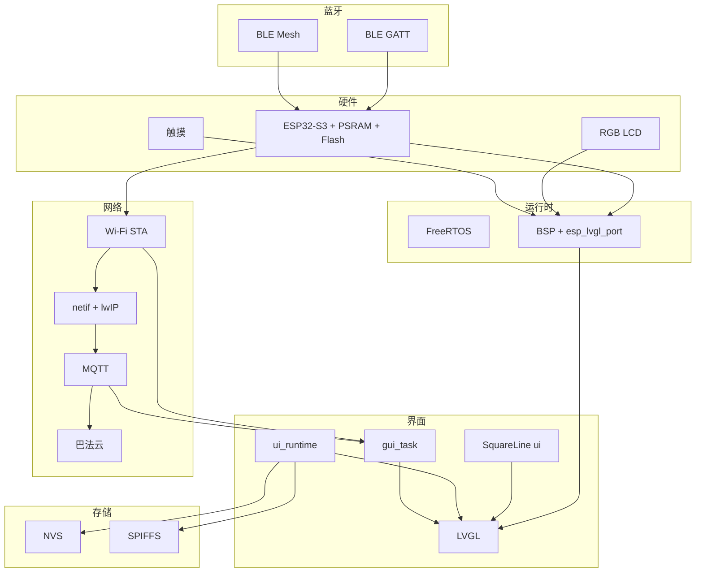

# 项目技术栈说明

本文档基于仓库内 **CMake**、`idf_component.yml`、`sdkconfig*` 与源码目录归纳，便于从架构与落地链路理解工程。

---

## 1. 仓库结构与两条产品线

> 完整目录树与模块边界见 [docs/PROJECT_STRUCTURE.md](docs/PROJECT_STRUCTURE.md)。

| 路径 | 角色 | 说明 |
|------|------|------|
| `components/` | **自研可发布组件** | 当前仅 `withthewind_board_lvgl_init`；见 [components/README.md](components/README.md) |
| 仓库根目录 | **主应用固件**（CMake 工程名 `lvgl_demo_v8`） | `main/main.c` 启动完整业务：BSP 显示、SquareLine/LVGL UI、`wifi_management`、`bt_management`、云 MQTT 等。 |
| `esp32_s3_frame/` | **模块化框架工程** | menuconfig 可选 Waveshare / `withthewind_board_lvgl_init`、SquareLine `ui/`、`ui_runtime` 及 Wi‑Fi/BT 等 monorepo 模块。见 `esp32_s3_frame/docs/MODULES.md`。 |
| `wifi_management/wifi_example/` | **ESP-IDF Wi‑Fi 示例集合** | 官方示例本地副本，用于对照 API；**主固件编译不依赖该目录树**。 |

**概念协作链**：硬件上电 → Bootloader 加载 **factory** 分区应用 → `app_main` → **系统基础（NVS / 网络栈 / 事件循环）** → **显示与输入（BSP + LVGL）** → **业务（Wi‑Fi / MQTT / BLE）** → 经 **队列 + LVGL 锁** 写回界面。

---

## 2. 核心技术（平台与运行时）

### 2.1 芯片：ESP32-S3

- **定位**：算力、Wi‑Fi/BT、RGB LCD、PSRAM、片内 Flash 等外设载体。
- **解决的问题**：单芯片并行 **协议栈（Wi‑Fi + lwIP + MQTT）**、**图形（RGB + LVGL）**、**蓝牙主机栈**。
- **配置要点**：`sdkconfig.defaults` 中 CPU 频率、Octal PSRAM、cache 行宽等，为帧缓冲与大图留足资源。

### 2.2 FreeRTOS

- **定位**：多任务、队列、事件组、软件定时器、任务绑核。
- **解决的问题**：LVGL 刷新、Wi‑Fi 事件、扫描、MQTT、授时等解耦到不同优先级与核心。
- **典型逻辑**：根应用将 LVGL 端口任务亲和设为 Core 1；`gui_task.c` 在 Core 1 消费队列，通过 `bsp_display_lock` + `lv_async_call` 投递到 LVGL 上下文。

### 2.3 C 语言 + CMake

- **定位**：固件主体与 ESP-IDF 标准工程描述。
- **关键文件**：根 `CMakeLists.txt` 引入 IDF 工程脚本；`main/CMakeLists.txt` 使用 `idf_component_register` 汇总 UI 与 `wifi_management`、`bt_management` 源码。

---

## 3. 开发框架与工程组织

### 3.1 ESP-IDF（配置文档可见 5.4.x 系）

- **定位**：驱动、网络、蓝牙、分区、引导、日志等统一 SDK。
- **流程**：`idf.py set-target esp32s3` → `build` → `flash monitor`；`sdkconfig` / `sdkconfig.defaults` 固化功能开关。

### 3.2 Component Manager（`main/idf_component.yml`）

- **显式依赖**：`esp32_s3_touch_lcd_4`、`lvgl/lvgl`（8.4.*，`public: true`）。
- **作用**：自动拉取板级 BSP 与 LVGL，减少手工拷贝。

### 3.3 框架工程（`esp32_s3_frame/components/*`）

- **分层**：`system_service`（NVS）、`board_port`（板级）、`ui_shell`（UI 后端）、`app_core`（编排）；可选 `frame_wifi` / `frame_bt` / `frame_gui` 引用 monorepo 源码。
- **启动**：`app_main` → `app_core_start()` → 系统服务 → 显示 → `ui_shell_load()` → 可选模块 start。

---

## 4. 人机交互与图形栈

### 4.1 LVGL 8.4

- **定位**：嵌入式 GUI 引擎。
- **配置**：`CONFIG_LV_*`（字体、绘制单元、OS 适配等）。
- **内存**：`main/CMakeLists.txt` 将 LVGL 动态分配导向 **PSRAM**（`LV_MEM_CUSTOM_*` + `lv_mem_psram_custom`），减轻内部 SRAM 压力。

### 4.2 SquareLine 生成 UI（`ui/`）

- **定位**：屏幕、组件、图片资源；业务与修复集中在 `ui_runtime.c`，减少直接改生成文件。

### 4.3 esp_lvgl_port（托管组件）

- **定位**：LVGL 与显示任务、锁、输入设备对接 ESP-IDF。
- **作用**：安全调度 `lv_timer_handler`，与 RGB 面板驱动协同。

### 4.4 BSP：`esp32_s3_touch_lcd_4`

- **定位**：`bsp_display_start_with_config`、`bsp_display_lock`、背光 PWM 等。
- **作用**：屏蔽 RGB LCD、触摸、扩展 IO 初始化；Kconfig 中多缓冲、direct mode 等用于防撕裂与流畅刷新。

### 4.5 显示与触摸驱动链（托管组件）

- **ST7701**：RGB 面板时序。
- **GT911 + esp_lcd_touch**：触摸输入到 LVGL。
- **esp_lcd_panel_io_additions**：板卡相关 IO 扩展。
- **custom_io_expander_ch32v003 + esp_io_expander**：扩展 GPIO（背光、蜂鸣器等）。

### 4.6 `gui_task.c`

- **定位**：非 LVGL 线程与 LVGL 线程之间的桥梁。
- **流程**：`gui_task_post_lvgl` → 队列 → `bsp_display_lock` → `lv_async_call` 执行回调。

---

## 5. 网络、时间与云

### 5.1 Wi‑Fi STA：`esp_wifi` + `esp_netif` + `esp_event`

- **定位**：联网与事件驱动状态机。
- **流程概要**（`wifi_management.c`）：
  1. `wifi_management_foundation_init()`：NVS、netif、默认事件循环。
  2. `wifi_management_start()`：默认 STA、事件处理、扫描任务等。
  3. 断线：区分认证失败 / 信号类退避 / 重试上限；调用 `wifi_bemfa_client_stop()` 避免无 IP 时无效 MQTT。
  4. `IP_EVENT_STA_GOT_IP`：更新状态、**启动** `wifi_bemfa_client_start()`、About 页网络信息、SNTP 任务、凭据写入 NVS。

### 5.2 lwIP / DNS

- **作用**：TCP/IP 与域名解析；MQTT 前需解析服务器主机名。

### 5.3 SNTP（`esp_sntp`）

- **作用**：授时，供界面日期时间与相关逻辑使用。

### 5.4 巴法云 MQTT（`wifi_bemfa_client.c` + ESP-IDF **mqtt**）

- **定位**：`esp_mqtt_client`，默认 `mqtt://bemfa.com:9501`，主题与 UID 在源码中配置。
- **流程概要**：
  1. 仅在 STA **已获得 IP** 后启动客户端并订阅。
  2. 连接成功上报在线、周期快照；下行解析后应用状态并回发。
  3. 读 UI 拼 JSON 时常经 `gui_task_post_lvgl` 保证线程安全。
  4. 与蓝牙模块头文件协同部分控制路径（见 `bemfa_apply_*` 实现）。

### 5.5 Wi‑Fi 与蓝牙共存

- **`CONFIG_ESP_COEX_SW_COEXIST_ENABLE`**：缓解 2.4 GHz 上 Wi‑Fi 与 BLE/Mesh 同时工作的干扰。

---

## 6. 蓝牙协议栈

### 6.1 Bluedroid BLE（ESP32-S3 无经典蓝牙）

- **定位**：控制器 + `esp_bluedroid`；`main/main.c` 中 `enabled_bredr = false`。
- **作用**：配对与绑定参数在 `bt_management.c` 中配置。

### 6.2 自定义 GATT（`bt_transport_ble.c`）

- **定位**：128-bit UUID 的 Service/RX/TX，Notify 与重组缓冲。
- **作用**：App 或上位机 BLE 控制与状态回传（与 `bt_proto` 配合）。

### 6.3 BLE Mesh（`bt_mesh_node.c` 等）

- **配置**：`CONFIG_BLE_MESH`、`CONFIG_BLE_MESH_NODE`、`CONFIG_BLE_MESH_PB_ADV` 等；PB-GATT 可按工程注释关闭以避免与自定义 GATT 冲突。
- **作用**：组网与 PB-ADV 配网；`bt_management` 提供启停与 factory reset 封装。

---

## 7. 存储与分区

### 7.1 NVS

- **用途**：`wifi_cfg`（SSID/密码）；`ui_runtime` 中界面与偏好键值（见源码中 namespace 定义）。

### 7.2 SPIFFS（`partitions.csv` + BSP Kconfig）

- **布局**：`storage` 分区类型 spiffs；挂载点常见为 `/spiffs`，label `storage`。
- **用途**：只读资源或文件类资产（具体读写以业务代码为准）。

### 7.3 Flash / 分区表

- **示例**：16MB Flash、自定义分区表、`factory` 应用区较大；当前表示为单槽 factory，OTA 槽位需自行扩展分区表若要做 OTA。

---

## 8. 中间件与库（速查）

| 技术 | 用途 |
|------|------|
| ESP-MQTT | 连接巴法云，订阅/发布 |
| esp_timer | 重连定时、MQTT 快照周期等 |
| FreeRTOS 队列 / 事件组 | `gui_task`、Wi‑Fi 连接状态位等 |
| esp_log | 分模块日志标签 |
| On-chip temperature sensor | `ui_runtime` 中芯片温度相关逻辑 |

---

## 9. 工具链与部署

| 类别 | 内容 |
|------|------|
| 开发 | `idf.py`、menuconfig、CMake |
| 优化 | 如 `CONFIG_COMPILER_OPTIMIZATION_PERF` |
| 部署 | esptool 烧录：Bootloader + 分区表 + factory 应用（+ 可选 SPIFFS 镜像） |
| 调试 | 串口监视；日志顺序可验证「联网 → DNS → MQTT → 订阅 → 上报」 |

---

## 10. 主固件端到端协作（Mermaid）

**主应用 `app_main` 顺序简述**：

1. `wifi_management_foundation_init()`  
2. `bt_management_init` / `bt_management_start`  
3. `bsp_display_start_with_config`、背光  
4. `ui_init`、`ui_runtime_apply`  
5. `gui_task_init`  
6. `wifi_management_start`；获 IP 后 `wifi_bemfa_client_start`；断线停云并重连 Wi‑Fi  

---

## 11. 边界说明

- **`esp32_s3_frame`**：可插拔模块框架；通过 menuconfig 选用 monorepo 中 `ui/`、`ui_runtime`、`wifi_management` 等，用于界面迭代与移植验证。
- **`wifi_management/wifi_example/`**：官方 Wi‑Fi 示例副本，**非**主 `main` 组件编译单元。  
- **云服务**：源码使用 `mqtt://` URI；是否 TLS 以 URI 与客户端配置为准，与 Kconfig 中 MQTT 传输能力选项区分理解。

---

*文档随仓库演进可能需手工更新；以实际 `sdkconfig` 与 `idf_component.yml` 为准。*
